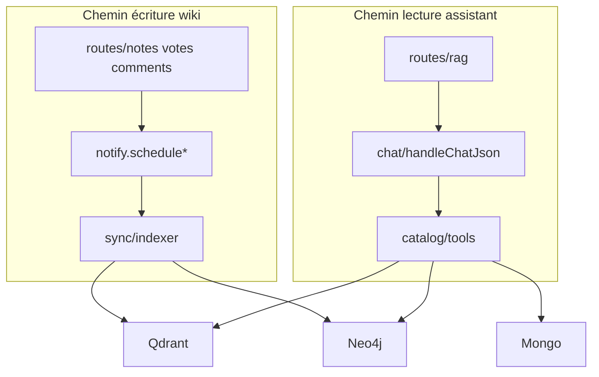

# 01 — Architecture GraphRAG

[← Index](./README.md) · [Sync →](./02-sync.md)

## Pourquoi GraphRAG ici ?

Le wiki stocke des notes collaboratives (HTML TipTap) dans MongoDB. L’assistant doit :

1. **Retrouver du contenu par sens** (« notes sur l’onboarding ») → embeddings + Qdrant.
2. **Répondre à des questions relationnelles / sociales** (« chemin entre A et B », « notes de Alice », « mieux notées ») → Neo4j.
3. **Lister avec filtres structurés** (YouTube, N derniers jours) → requêtes Mongo directes, plus fiables qu’un LLM qui invente des filtres.

Le pattern choisi : **agent à tools** (Vercel AI SDK `generateText` + `maxSteps`) plutôt qu’un seul prompt RAG « stuff context ». Les tools partagent un catalogue unique entre le chat et le serveur MCP.

## Stores

| Store | Obligatoire ? | Rôle |
|-------|---------------|------|
| **MongoDB** | Oui (wiki) | Source de vérité : notes, users, votes, comments, tags |
| **Qdrant** | Oui pour RAG | Collection de points (chunks) + payload métadonnées |
| **Neo4j** | Non | Graphe Note / User / Tag / Comment + relations |
| **LLM** | Oui pour RAG | Embeddings (index + search) + modèle chat (agent) |

### Flags de configuration

Définis dans [`packages/backend/src/rag/config.ts`](../../packages/backend/src/rag/config.ts) :

| Fonction | Condition |
|----------|-----------|
| `isLlmConfigured()` | `LLM_PROVIDER=openai` → `OPENAI_API_KEY` ; ou `openrouter` → `OPENROUTER_API_KEY` |
| `isRagConfigured()` | `QDRANT_URL` **et** `isLlmConfigured()` |
| `isGraphConfigured()` | `isRagConfigured()` **et** `NEO4J_URI` + user + password |

Comportement :

- `!isRagConfigured()` → `POST /rag/chat` et sync admin renvoient / échouent avec `RAG_DISABLED` ; le reste du wiki fonctionne.
- `isRagConfigured() && !isGraphConfigured()` → search + tools Mongo OK ; tools Neo4j passent par `softGraphTool` et renvoient `GRAPH_UNAVAILABLE` sans faire planter le chat.

## Arborescence `packages/backend/src/rag/`

```
rag/
├── config.ts              # ragConfig + isRagConfigured / isGraphConfigured
├── types.ts               # CatalogDocument, SearchHit, NoteSource…
├── notes-source.ts        # loadPublishedNotes / loadPublishedNoteById (Mongo)
├── social-source.ts       # votes / comments pour upsert graphe
├── html.ts                # htmlToText, chunkText
├── notify.ts              # schedule* fire-and-forget depuis les routes wiki
│
├── sync/
│   ├── indexer.ts         # runFullSync, upsertNoteIndex, deleteNoteIndex, syncNoteSocial
│   ├── documents.ts       # buildNoteDocuments (chunking + payload)
│   ├── meta.ts            # meta d’indexation en Mongo
│   └── state.ts           # lock in-process + last result
│
├── vector/
│   └── qdrant.ts          # client, ensureCollection, upsert, search, prune, patch stats
│
├── graph/
│   ├── neo4j.ts           # driver / ping / run Cypher (bolt ou HTTP)
│   ├── schema.ts          # contraintes + migration Author → User
│   ├── upsert.ts          # upsertNotesGraph / upsertNoteGraph / deleteNoteGraph
│   ├── social-upsert.ts   # arêtes RATED, WROTE, REACTED…
│   ├── links.ts           # résolution liens internes entre notes
│   └── query.ts           # relatedNotes, graphPathBetweenNotes, rankings…
│
├── catalog/
│   └── tools.ts           # impl métier pure (appelée par chat + MCP)
│
├── chat/
│   ├── chat.ts            # handleChatJson — entrée unique du chat JSON
│   ├── tools.ts           # wrappers Vercel AI SDK + softGraphTool
│   ├── intent.ts          # resolveChatIntent (prefetch vs auto)
│   ├── prompts.ts         # system prompt + règles de citation
│   ├── retrieve.ts        # retrieveNotes / retrieveNotesWithGraph
│   ├── model.ts           # createChatModel (AI SDK)
│   ├── guardrails.ts      # rate limit, sanitize, jailbreak, off-topic
│   ├── circuit.ts         # circuit breaker LLM
│   └── types.ts           # StreamChatMessage
│
├── llm/
│   ├── types.ts           # ILlmProvider { embed, chat }
│   ├── index.ts           # getLlmProvider() factory
│   ├── openai.ts
│   ├── openrouter.ts
│   └── client.ts          # HTTP OpenAI-compatible
│
└── mcp/
    └── server.ts          # MCP HTTP + JSON-RPC sur /rag/mcp*
```

Routes HTTP : [`packages/backend/src/routes/rag.ts`](../../packages/backend/src/routes/rag.ts), montées sous `/rag` dans [`index.ts`](../../packages/backend/src/index.ts) avec `requireAuth` sur `/rag/*`.

CLI sync (hors Lambda) : [`packages/backend/src/scripts/rag-sync.ts`](../../packages/backend/src/scripts/rag-sync.ts).

Infra Docker : [`docker-compose.rag.yml`](../../docker-compose.rag.yml) (dev), [`docker-compose.rag.prod.yml`](../../docker-compose.rag.prod.yml) (VPS).

## Couches de responsabilité



| Couche | Ne doit pas… |
|--------|----------------|
| `catalog/tools.ts` | Connaître Vercel AI SDK ni MCP |
| `chat/tools.ts` | Contenir du Cypher / SQL métier |
| `mcp/server.ts` | Dupliquer la logique métier (réutiliser le catalogue) |
| `notify.ts` | Bloquer la requête HTTP wiki (fire-and-forget) |

## Endpoints RAG

| Méthode | Path | Auth | Rôle |
|---------|------|------|------|
| `GET` | `/rag/health` | JWT | Ping Qdrant + Neo4j |
| `POST` | `/rag/chat` | JWT | Chat JSON (assistant) |
| `POST` | `/rag/admin/sync` | JWT + admin | Full sync |
| `GET` | `/rag/admin/sync/status` | JWT + admin | Statut sync |
| `GET` | `/rag/mcp` | JWT | Découverte MCP |
| `GET` | `/rag/mcp/tools` | JWT | Liste tools |
| `POST` | `/rag/mcp/tools/:name` | JWT | Appel tool direct |
| `POST` | `/rag/mcp` | JWT | JSON-RPC MCP |

## Invariants à respecter

1. Seules les notes **publiées** sont indexées (`loadPublishedNotes`).
2. Un changement de modèle d’embedding / de dimensions impose un **reindex full** (nouvelle collection ou wipe).
3. Le sync Neo4j ne doit pas faire échouer le sync Qdrant (fail-soft + timeout 12s en full sync).
4. Les citations dans le chat doivent utiliser `urlPath` issu des tools + `PUBLIC_APP_URL` (voir prompts).
