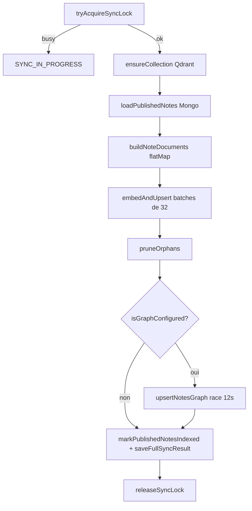

# 02 — Synchronisation des données

[← Architecture](./01-architecture.md) · [Index](./README.md) · [Retrieval →](./03-retrieval.md)

La sync pousse MongoDB → **Qdrant** (toujours en premier) puis **Neo4j** (optionnel, fail-soft).  
Logique centrale : [`packages/backend/src/rag/sync/indexer.ts`](../../packages/backend/src/rag/sync/indexer.ts).

## Trois modes

| Mode | Déclencheur | Qdrant | Neo4j | Re-embed ? |
|------|-------------|--------|-------|------------|
| **Full** | CLI / admin API | Upsert tous les chunks + prune orphans | `upsertNotesGraph` (timeout 12s) | Oui |
| **Incrémental note** | create / update / unpublish / delete | Delete points note + re-upsert si published | Upsert ou delete nœud | Oui (cette note) |
| **Social** | vote / comment / reaction | `patchNotePayloadStats` seulement | Upsert arêtes sociales | **Non** |

## Chunking (documents)

[`sync/documents.ts`](../../packages/backend/src/rag/sync/documents.ts) — `buildNoteDocuments(note)` :

1. Corps : `htmlToText(note.contentHtml)`.
2. Header textuel : titre, auteur, tags, avgRating/votes, commentCount.
3. Texte = `header + "\n\n" + body`.
4. Découpe : `chunkText(fullText, RAG_CHUNK_SIZE, RAG_CHUNK_OVERLAP)` (défauts 1000 / 150).
5. Chaque chunk → `CatalogDocument` avec :
   - `pointId` : hash déterministe `pointIdFor("note", \`${noteId}:${chunkIndex}\`)`
   - `type: "note"`
   - `text` : contenu à embedder
   - `payload` : `noteId`, `title`, `tags`, `chunkIndex`, `urlPath` (`/${id}`), `label`, `authorId`, `authorName`, `avgRating`, `voteCount`, `commentCount`

Si aucun chunk (corps vide) : un point unique avec le header seul.

## Full sync — `runFullSync(db)`



Détails importants :

- **Lock in-process** (`sync/state.ts`) : deux full syncs concurrents dans le même process → le 2ᵉ reçoit `SYNC_IN_PROGRESS` (HTTP 409 côté admin).
- **Embeddings** : `getLlmProvider().embed(texts)` par batch de 32, **3 retries** avec backoff exponentiel (`withRetry`).
- **Orphans** : points Qdrant dont l’id n’est plus dans le set des documents courants → `deletePointsByIds`.
- **Neo4j** : `Promise.race` avec timeout `GRAPH_SYNC_TIMEOUT_MS = 12_000`. En cas d’échec / timeout → `console.warn`, le sync reste `ok: true` si Qdrant a réussi (budget Lambda).
- **Meta Mongo** : `markPublishedNotesIndexed`, `saveFullSyncResult` pour le status admin.

### CLI

```bash
npm run rag:sync                              # full
npm run rag:sync -- --note-id <objectId>      # une note
npm run rag:sync -- --delete-note <objectId>  # purge
```

Script : [`packages/backend/src/scripts/rag-sync.ts`](../../packages/backend/src/scripts/rag-sync.ts).  
Lit le `.env`, vérifie `isRagConfigured()`, ping Qdrant, puis appelle l’indexer. **Pas de JWT** (usage ops / local).

### Admin API

```bash
# Full sync (admin)
curl -X POST "$API/rag/admin/sync" \
  -H "Authorization: Bearer <admin_token>"

# Status
curl "$API/rag/admin/sync/status" \
  -H "Authorization: Bearer <admin_token>"
```

Implémentation : [`routes/rag.ts`](../../packages/backend/src/routes/rag.ts) → `requireAdmin`.

## Sync incrémental notes

Branchement : [`notify.ts`](../../packages/backend/src/rag/notify.ts) appelé depuis [`routes/notes.ts`](../../packages/backend/src/routes/notes.ts).

| Événement wiki | Fonction |
|----------------|----------|
| Note publiée / mise à jour publiée | `scheduleNoteIndexUpsert(db, noteId)` |
| Unpublish / delete | `scheduleNoteIndexDelete(db, noteId)` (ou upsert qui voit « non published ») |

`schedule*` = `void upsert…().catch(warn)` — **ne bloque pas** la réponse HTTP du wiki.

### `upsertNoteIndex(db, noteId)`

1. `ensureCollection()`
2. Charge la note publiée ; si absente → delete points Qdrant + `deleteNoteGraph` + clear meta → `{ deleted: true }`
3. Sinon : `deletePointsByNoteId` (évite les vieux chunkIndex), `buildNoteDocuments`, `embedAndUpsert`, `upsertNoteGraph` (catch warn), `markNoteIndexed`

### `deleteNoteIndex(db, noteId)`

Delete points + graphe + meta.

## Sync social (sans re-embed)

Branchement :

- [`routes/votes.ts`](../../packages/backend/src/routes/votes.ts) → `scheduleNoteSocialSync`
- [`routes/comments.ts`](../../packages/backend/src/routes/comments.ts) → `scheduleNoteSocialSync`

### `syncNoteSocial(db, noteId)`

1. Recharge la note publiée (sinon delete graphe).
2. Si graphe configuré : `upsertNoteGraph` (structure + arêtes sociales via `social-upsert.ts`).
3. `patchNotePayloadStats` sur tous les points Qdrant de la note : `avgRating`, `voteCount`, `commentCount`, auteur — **sans** recalculer les vecteurs.

Pourquoi : un vote ne change pas le sens sémantique du texte, seulement les stats affichées / filtrables côté payload.

## Collection Qdrant

[`vector/qdrant.ts`](../../packages/backend/src/rag/vector/qdrant.ts) — `ensureCollection()` :

- Nom : `QDRANT_COLLECTION` (défaut `cinco_wiki`)
- Vecteur : taille `EMBEDDING_DIMENSIONS` (défaut 1536), distance Cosine
- Indexes payload : au minimum `noteId`, `type` (pour filtres / deletes)

## Graphe Neo4j à l’upsert

[`graph/upsert.ts`](../../packages/backend/src/rag/graph/upsert.ts) + [`social-upsert.ts`](../../packages/backend/src/rag/graph/social-upsert.ts) + [`schema.ts`](../../packages/backend/src/rag/graph/schema.ts) :

- Contraintes uniques : `Note.id`, `Tag.name`, `User.id`, `Comment.id`
- Migration legacy `Author` → `User` au `ensureGraphSchema`
- Relations typiques : `AUTHORED`, `HAS_TAG`, `LINKS_TO`, `RATED`, `WROTE` / `ON_NOTE`, `REACTED`…

Détails Cypher côté lecture : [03 — Retrieval](./03-retrieval.md).

## Pièges sync

| Symptôme | Cause probable | Action |
|----------|----------------|--------|
| `SYNC_IN_PROGRESS` | Double full sync | Attendre / un seul process |
| Sync OK mais graphe vide | Neo4j timeout 12s ou `NEO4J_*` manquant | Logs `[rag] neo4j…`, augmenter timeout si besoin, vérifier Bolt |
| Chunks obsolètes après unpublish | Incrémental non déclenché | Vérifier appels `schedule*` dans routes notes ; sinon `rag:sync -- --delete-note` |
| Scores absurdes après changement de modèle embed | Dimensions / modèle différent | Full sync (voire recreate collection) |
| `QDRANT_API_KEY=""` en local | Client envoie une clé vide, Qdrant refuse | **Omettre** la variable plutôt que string vide |
| Indexation lente en Lambda | Trop de notes + timeout | Préférer CLI `rag:sync` depuis une machine avec le `.env` prod |

## Checklist après déploiement

1. `GET /rag/health` → `qdrant: true`, `neo4j: true` si GraphRAG voulu.
2. `npm run rag:sync` (ou admin sync) → `ok: true`, `notes` / `chunks` / `upserted` cohérents.
3. Publier une note test → vérifier points dans Qdrant dashboard + nœud dans Neo4j Browser.
4. Voter sur la note → stats payload mises à jour **sans** nouveau batch embed dans les logs.
