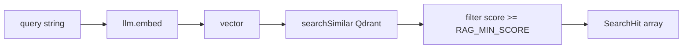
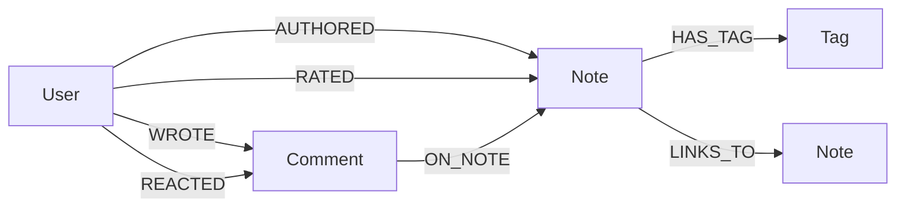

# 03 — Récupération des données (retrieval)

[← Sync](./02-sync.md) · [Index](./README.md) · [Chat agent →](./04-chat-agent.md)

Trois sources de lecture selon le tool :

| Source | Usage typique | Entrée code |
|--------|---------------|-------------|
| **Qdrant** | Sujet / sens | `retrieveNotes` → `searchSimilar` |
| **MongoDB** | Contenu exact, filtres date/host, tags, top auteurs | `notes-source.ts`, `getNote`, `findNotes` |
| **Neo4j** | Voisinage, chemins, classements sociaux | `graph/query.ts` |

Le catalogue [`catalog/tools.ts`](../../packages/backend/src/rag/catalog/tools.ts) orchestre ces sources. L’agent n’y accède jamais directement autrement.

## Recherche vectorielle

### Pipeline `retrieveNotes`

Fichier : [`chat/retrieve.ts`](../../packages/backend/src/rag/chat/retrieve.ts).



1. `getLlmProvider().embed([query])` — même modèle que l’index (`EMBEDDING_MODEL`).
2. `searchSimilar(vector, { limit: RAG_TOP_K, type: "note" })` dans [`vector/qdrant.ts`](../../packages/backend/src/rag/vector/qdrant.ts).
3. Filtre `h.score >= RAG_MIN_SCORE` (défaut `0.22`).

### Tool `searchNotes`

Dans le catalogue :

- Appelle `retrieveNotes`.
- Déduplique par `noteId` (plusieurs chunks → une note).
- Renvoie `{ notes: [{ noteId, title, tags, urlPath, excerpt, score }], grounded }`.

L’agent voit les scores en JSON tool, mais le system prompt lui dit de **ne pas** les afficher à l’utilisateur.

### Payload utile côté hit

Champs typiques dans `hit.payload` :

- `noteId`, `title` / `label`, `tags`, `chunkIndex`
- `urlPath` — base des citations markdown (ex. `/6a477088c7a6c5d8ff48ed84`)
- `authorId`, `authorName`
- `avgRating`, `voteCount`, `commentCount`
- parfois `text` (selon ce qui a été stocké à l’upsert)

### GraphRAG « retrieve + voisinage »

`retrieveNotesWithGraph(query)` :

1. `retrieveNotes` comme ci-dessus.
2. Si Neo4j configuré et hits non vides → `relatedNotes(seedId, depth=1)` sur le **top hit**.
3. `formatGraphContext` produit une chaîne textuelle pour un éventuel stuffing de contexte.

> Note : le chat JSON actuel (`handleChatJson`) s’appuie surtout sur les **tools** (`searchNotes`, `relatedNotes`, …), pas sur un stuffing automatique de `retrieveNotesWithGraph`. Cette fonction reste disponible pour d’autres flux / expérimentation.

## Lecture Mongo

| Tool | Fonction source | Rôle |
|------|-----------------|------|
| `getNote` | `loadPublishedNoteById` (+ fallback titre via Qdrant scroll) | Contenu texte (tronqué ~4000) |
| `findNotes` | `findPublishedNotes` | Filtres `sinceDays`, `linkHost`, `sort`, `limit` |
| `listTags` | `listTagNames` | Tags wiki |
| `topContributors` | `loadTopContributors` | Classement auteurs |

Ces tools sont aussi ceux du **prefetch intent** (voir [04](./04-chat-agent.md)) : plus déterministes que laisser le LLM choisir.

## Graphe Neo4j

Schéma / contraintes : [`graph/schema.ts`](../../packages/backend/src/rag/graph/schema.ts).  
Requêtes : [`graph/query.ts`](../../packages/backend/src/rag/graph/query.ts).

### Labels & relations (vue opérationnelle)



### Tools graphe → fonctions Cypher

| Tool catalogue | Fonction `query.ts` | Idée Cypher |
|----------------|---------------------|-------------|
| `relatedNotes` | `relatedNotes` / `queryRelatedNotes` | Voisinage `[*1..depth]` depuis une Note |
| `notesBySharedTags` | `queryNotesBySharedTags` | `(n)-[:HAS_TAG]->(t)<-[:HAS_TAG]-(other)` |
| `graphPath` | `graphPathBetweenNotes` | `shortestPath((a)-[*..6]-(b))` |
| `topRatedNotes` | `queryTopRatedNotes` | ORDER BY `avgRating` / votes |
| `mostCommentedNotes` | `queryMostCommentedNotes` | ORDER BY commentCount |
| `notesByAuthor` | `queryNotesByAuthor` | MATCH User → AUTHORED → Note |
| `authorsByTag` | `queryAuthorsByTag` | Tag → notes → auteurs |
| `noteRatings` / `notesRatedByUser` | … | Arêtes `RATED` |
| `noteComments` / `notesCommentedByUser` | … | Comment / WROTE |

### Focus : `graphPath`

Résolution des extrémités : id Mongo **ou** titre approximatif (MATCH Note WHERE id / title).  
Puis :

```cypher
MATCH path = shortestPath((a)-[*..6]-(b))
RETURN nodes(path) AS nodes, relationships(path) AS rels
```

Résultat catalogue :

```ts
{ found: boolean, path: string[], notes: GraphNote[] }
```

- `path` alterne titres / noms de nœuds intermédiaires (Tag, User…) et **types de relation** (`HAS_TAG`, `AUTHORED`, …).
- `notes` : uniquement les nœuds label `Note` du chemin (pour citations).

Profondeur max du shortest path : **6** hops (évite explosions sur graphe dense).

### Soft-fail côté agent

Dans [`chat/tools.ts`](../../packages/backend/src/rag/chat/tools.ts), les tools Neo4j sont wrappés par `softGraphTool` :

- Succès → résultat normal.
- Exception → `{ ...empty, ok: false, error: "GRAPH_UNAVAILABLE" }` + `console.warn([rag] tool <name>: …)`.

Le LLM peut alors répondre sans planter (souvent en basculant sur `searchNotes` / `findNotes`).

## Paramètres retrieval (env)

| Variable | Défaut | Effet |
|----------|--------|-------|
| `RAG_TOP_K` | `8` | Nombre de hits Qdrant |
| `RAG_MIN_SCORE` | `0.22` | Seuil de similarité |
| `EMBEDDING_MODEL` | `text-embedding-3-small` | Doit matcher l’index |
| `EMBEDDING_DIMENSIONS` | `1536` | Doit matcher la collection Qdrant |
| `QDRANT_COLLECTION` | `cinco_wiki` | Nom collection |

## Debugger une mauvaise retrieval

1. **Health** : `GET /rag/health` — Qdrant / Neo4j up ?
2. **Sync** : la note publiée a-t-elle des points ? (dashboard Qdrant filter `noteId`).
3. **Score** : baisser temporairement `RAG_MIN_SCORE` en local pour voir si le hit existe mais est filtré.
4. **Embedding mismatch** : même `EMBEDDING_MODEL` + dimensions à l’index et à la query.
5. **Tool isolé** via MCP :

```bash
curl -X POST "$API/rag/mcp/tools/searchNotes" \
  -H "Authorization: Bearer <token>" \
  -H "Content-Type: application/json" \
  -d '{"query":"onboarding","limit":5}'
```

6. **Neo4j Browser** : `MATCH (n:Note) RETURN count(n)` ; tester un `shortestPath` à la main.
