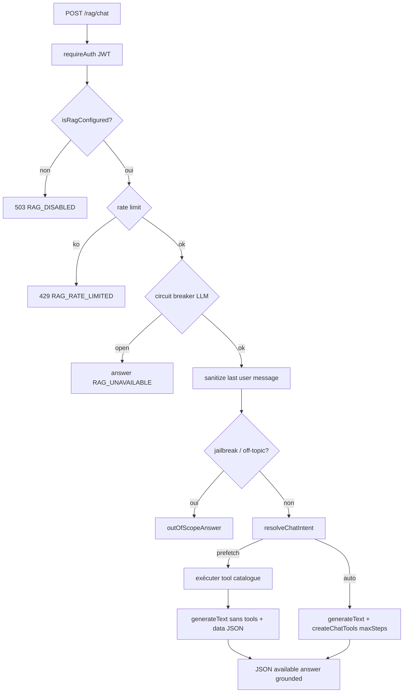

# 04 — Agent chat & questionnement GraphRAG

[← Retrieval](./03-retrieval.md) · [Index](./README.md) · [Deploy →](./05-deploy.md)

Entrée unique : `handleChatJson` dans [`packages/backend/src/rag/chat/chat.ts`](../../packages/backend/src/rag/chat/chat.ts).  
Route : `POST /rag/chat` ([`routes/rag.ts`](../../packages/backend/src/routes/rag.ts)).

## Pipeline bout-en-bout



### 1. Auth & config

- Toutes les routes `/rag/*` passent par `requireAuth` ([`index.ts`](../../packages/backend/src/index.ts)).
- Sans RAG configuré → `{ available: false, error: "RAG_DISABLED" }` status 503.

### 2. Rate limit

[`guardrails.ts`](../../packages/backend/src/rag/chat/guardrails.ts) — buckets mémoire par `clientKey` :

Priorité clé : header `x-forwarded-for` / `x-real-ip` → sinon `sessionId` → sinon `userId`.

Limite : `RAG_RATE_LIMIT` req / minute (défaut 30). Dépassement → 429 + message localisé.

### 3. Circuit breaker

[`circuit.ts`](../../packages/backend/src/rag/chat/circuit.ts) :

- Après **5** échecs LLM consécutifs → circuit ouvert 60s.
- Mode half-open : une sonde autorisée après cooldown.
- Succès → reset ; échec dans `handleChatJson` → `recordLlmFailure()`.

### 4. Guardrails entrée

- `sanitizeInput` : strip contrôles, trim, truncate `RAG_MAX_INPUT_CHARS` (2000).
- Jailbreak patterns (`ignore previous instructions`, etc.) → réponse out-of-scope.
- Off-topic (médical / crypto trading / shopping) → idem.
- Message user vide → out-of-scope.

### 5. Intent : prefetch vs auto

[`intent.ts`](../../packages/backend/src/rag/chat/intent.ts) — `resolveChatIntent(lastUser)` :

| Pattern (FR/EN simplifié) | Intent | Tool / args |
|---------------------------|--------|-------------|
| meilleur contributeur, top auteurs… | prefetch | `topContributors` limit 10 |
| liste des tags… | prefetch | `listTags` |
| youtube / youtu.be | prefetch | `findNotes` linkHost youtube.com |
| notes récentes / depuis N jours | prefetch | `findNotes` sinceDays + sort createdAt |
| mieux notées / best rated | prefetch | `findNotes` sort avgRating |
| plus commentées | prefetch | `findNotes` sort commentCount |
| sinon (sujet libre) | auto | hint `searchNotes` |

**Prefetch** (`chat.ts`) :

1. Exécute le tool catalogue **côté serveur** (`prefetchToolData`).
2. `generateText` **sans** `tools` : system prompt + bloc `Données outils (faites…) : ${JSON.stringify(data)}`.
3. Le modèle ne peut pas appeler d’autres tools — il reformule les faits.

**Auto** :

1. `generateText` avec `tools: createChatTools(db)`, `maxSteps: RAG_MAX_STEPS` (défaut **3**).
2. Le modèle choisit parmi le catalogue fixe (search, graphe, etc.).
3. `grounded` = `(result.steps?.length ?? 0) > 0`.

Budget Lambda : peu de steps volontairement — chaque step = round-trip LLM (+ tools).

### 6. Modèle & prompts

- Modèle : `createChatModel()` ([`model.ts`](../../packages/backend/src/rag/chat/model.ts)) — OpenAI ou OpenRouter via `@ai-sdk/openai`.
- System : `buildStreamSystemPrompt(locale, intent)` ([`prompts.ts`](../../packages/backend/src/rag/chat/prompts.ts)) :
  - rôle GraphRAG + catalogue tools ;
  - règles « utiliser les tools, ne pas inventer » ;
  - citations markdown avec `PUBLIC_APP_URL` + `urlPath` ;
  - hint d’intention (prefetch / searchNotes) ;
  - langue fr/en.

Temperature : `0.2`.

## Comment l’IA questionne le graphe

En mode **auto**, le LLM lit les descriptions des tools dans [`chat/tools.ts`](../../packages/backend/src/rag/chat/tools.ts) et décide d’appeler (exemples) :

| Question utilisateur | Tools attendus |
|----------------------|----------------|
| « Notes sur le SSO » | `searchNotes` → éventuellement `getNote` |
| « Notes liées à X » | `relatedNotes` ou `notesBySharedTags` |
| « Lien entre note A et note B » | `graphPath` (`from` / `to` = id ou titre) |
| « Notes d’Alice » | `notesByAuthor` |
| « Qui a tagué devops ? » | `authorsByTag` |
| « Détail des votes sur Y » | `noteRatings` |

### Exemple `graphPath`

1. LLM appelle tool `graphPath` avec `{ from: "Onboarding", to: "SSO" }`.
2. Wrapper `softGraphTool` → `catalog.graphPath` → `graphPathBetweenNotes`.
3. Cypher `shortestPath` (max 6 hops) via tags / users / liens.
4. Retour `{ found, path, notes }` injecté dans le contexte du step suivant.
5. LLM produit une réponse markdown citant les notes du chemin.

Si Neo4j down → soft-fail `GRAPH_UNAVAILABLE` ; le modèle peut reformuler ou utiliser `searchNotes`.

## Catalogue tools (agent)

| Tool | Store | Soft-fail Neo4j ? |
|------|-------|-------------------|
| `searchNotes` | Qdrant | non |
| `getNote` | Mongo (+ fallback) | non |
| `listTags` | Mongo | non |
| `findNotes` | Mongo | non |
| `topContributors` | Mongo | non |
| `relatedNotes` | Neo4j | oui |
| `notesBySharedTags` | Neo4j | oui |
| `graphPath` | Neo4j | oui |
| `topRatedNotes` | Neo4j | oui |
| `mostCommentedNotes` | Neo4j | oui |
| `notesByAuthor` | Neo4j | oui |
| `noteRatings` | Neo4j | oui |
| `notesRatedByUser` | Neo4j | oui |
| `noteComments` | Neo4j | oui |
| `notesCommentedByUser` | Neo4j | oui |
| `authorsByTag` | Neo4j | oui |

MCP expose le **même** catalogue (+ alias `listRecentNotes`) — voir [06](./06-tools-debug.md).

## Réponse HTTP

```json
{
  "available": true,
  "answer": "… markdown …",
  "grounded": true,
  "error": null
}
```

| `error` | HTTP | Signification |
|---------|------|---------------|
| `RAG_DISABLED` | 503 | Config manquante |
| `RAG_RATE_LIMITED` | 429 | Trop de requêtes |
| `RAG_TIMEOUT` | 200* | Timeout LLM (answer = message timeout) |
| `RAG_UNAVAILABLE` | 200* | Circuit / erreur LLM |

\* Sur timeout / unavailable, `available` reste souvent `true` avec un `answer` friendly + `error` renseigné (le front lit `error` / `answer`).

## Pas de streaming

Le contrat actuel est **JSON one-shot** (pas SSE / WebSocket). Le front attend la réponse complète. Le nom `STREAM_SYSTEM_PROMPT` / `buildStreamSystemPrompt` est historique ; le transport n’est pas streamé.

## Tests manuels utiles

```bash
# Prefetch contributeurs
curl -s -X POST "$API/rag/chat" \
  -H "Authorization: Bearer $TOKEN" -H "Content-Type: application/json" \
  -d '{"messages":[{"role":"user","content":"Qui est le meilleur contributeur ?"}],"locale":"fr"}'

# Auto + search
curl -s -X POST "$API/rag/chat" \
  -H "Authorization: Bearer $TOKEN" -H "Content-Type: application/json" \
  -d '{"messages":[{"role":"user","content":"Quelles notes parlent d onboarding ?"}],"locale":"fr"}'

# Graph path (nécessite Neo4j + notes liées)
curl -s -X POST "$API/rag/chat" \
  -H "Authorization: Bearer $TOKEN" -H "Content-Type: application/json" \
  -d '{"messages":[{"role":"user","content":"Quel est le chemin entre la note A et la note B ?"}],"locale":"fr"}'
```

Logs à surveiller côté API : `[rag] chat error:…`, `[rag] tool graphPath:…`.
