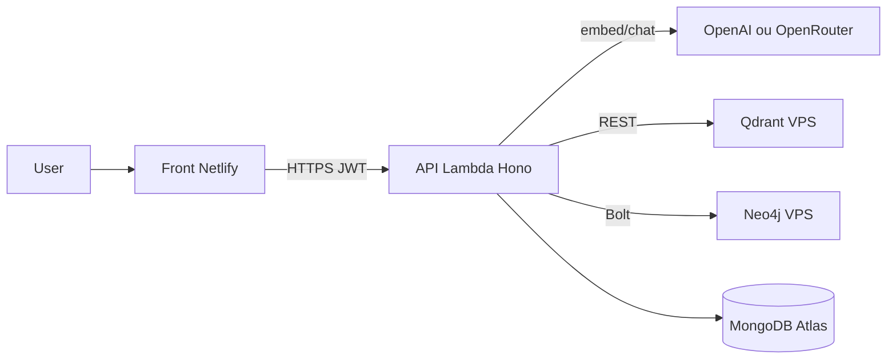

# 05 — Déploiement

[← Chat agent](./04-chat-agent.md) · [Index](./README.md) · [Tools & debug →](./06-tools-debug.md)

L’assistant GraphRAG = **backend Lambda (ou serverless offline)** + **stores Qdrant/Neo4j** (souvent sur un VPS) + secrets SSM. Le code RAG ne tourne pas dans les conteneurs Docker : ceux-ci n’hébergent que Qdrant et Neo4j.

## Architecture déploiement



## Variables d’environnement

Source de vérité runtime : [`ragConfig`](../../packages/backend/src/rag/config.ts). Exemple local : [`.env.example`](../../.env.example). Prod Lambda : SSM `/cinco-wiki/<stage>/…` (voir [`serverless.yml`](../../serverless.yml)).

### Obligatoires pour activer le RAG

| Variable | Défaut | Rôle |
|----------|--------|------|
| `QDRANT_URL` | — | URL HTTP(S) Qdrant |
| `OPENAI_API_KEY` **ou** `OPENROUTER_API_KEY` | — | Selon `LLM_PROVIDER` |

### LLM

| Variable | Défaut | Rôle |
|----------|--------|------|
| `LLM_PROVIDER` | `openai` | `openai` \| `openrouter` |
| `CHAT_MODEL` | `gpt-4o-mini` | Modèle agent (`createChatModel`) |
| `EMBEDDING_MODEL` | `text-embedding-3-small` | Index + query |
| `EMBEDDING_DIMENSIONS` | `1536` | Taille vecteur Qdrant |
| `OPENAI_BASE_URL` / `LLM_BASE_URL` | — | Proxy / Azure OpenAI-compatible |
| `OPENROUTER_BASE_URL` | `https://openrouter.ai/api/v1` | |
| `OPENROUTER_HTTP_REFERER` | `http://localhost:3001` | Headers OpenRouter |
| `OPENROUTER_APP_NAME` | `CincoWikiRAG` | Header titre |

### Qdrant / Neo4j

| Variable | Défaut | Rôle |
|----------|--------|------|
| `QDRANT_API_KEY` | — | Auth Qdrant (prod). En local : **omettre** si pas d’auth |
| `QDRANT_COLLECTION` | `cinco_wiki` | Nom collection |
| `NEO4J_URI` | — | `bolt://…` local ; `neo4j+s://…` Aura |
| `NEO4J_USER` | `neo4j` | |
| `NEO4J_PASSWORD` | — | |

### Tuning RAG

| Variable | Défaut | Rôle |
|----------|--------|------|
| `PUBLIC_APP_URL` | — | Base URL front pour citations (sans slash final) |
| `RAG_MIN_SCORE` | `0.22` | Seuil similarité |
| `RAG_TOP_K` | `8` | Hits Qdrant |
| `RAG_MAX_INPUT_CHARS` | `2000` | Truncate user |
| `RAG_RATE_LIMIT` | `30` | Req / minute / clientKey |
| `RAG_TIMEOUT_MS` | `25000` | Timeout client LLM chat bas niveau |
| `RAG_EMBED_TIMEOUT_MS` | `60000` | Timeout embed |
| `RAG_CHUNK_SIZE` | `1000` | Taille chunk |
| `RAG_CHUNK_OVERLAP` | `150` | Overlap |
| `RAG_MAX_STEPS` | `3` | Steps agent tools |

Front : `NEXT_PUBLIC_API_URL` → URL de l’API (pas besoin d’URL Qdrant côté browser).

## Local

```bash
npm run qdrant:up          # docker-compose.rag.yml
# renseigner .env (QDRANT_URL, OPENAI_*, NEO4J_*, MONGODB_URI, JWT_SECRET, PUBLIC_APP_URL)
npm run rag:sync
npm run dev                # API : souvent http://localhost:3000
npm run frontend           # UI : http://localhost:3001 → /ask
```

Compose dev ([`docker-compose.rag.yml`](../../docker-compose.rag.yml)) :

| Service | Ports | Auth |
|---------|-------|------|
| Qdrant | 6333, 6334 | Aucune par défaut |
| Neo4j | 7474, 7687 | `NEO4J_USER` / `NEO4J_PASSWORD` (défaut `neo4j` / `changeme`) |

## VPS (Qdrant + Neo4j prod)

Fichier : [`docker-compose.rag.prod.yml`](../../docker-compose.rag.prod.yml).

```bash
cp .env.rag.prod.example .env.rag.prod   # si présent dans le repo
# Renseigner : QDRANT_API_KEY, NEO4J_USER, NEO4J_PASSWORD
npm run rag:prod:up
```

Secrets compose (uniquement ces 3) :

- `QDRANT_API_KEY` — injecté dans `QDRANT__SERVICE__API_KEY`
- `NEO4J_USER` / `NEO4J_PASSWORD` → `NEO4J_AUTH`

Ports documentés dans le compose (REST 6333, Browser 7474, Bolt 7687). En prod, **ne pas exposer Bolt sur Internet** ; préférer bind `127.0.0.1` + reverse proxy TLS uniquement pour Qdrant si besoin distant.

Côté Lambda, pointer :

```bash
QDRANT_URL=https://qdrant.example.com   # ou http://127.0.0.1:6333 via VPC / tunnel
QDRANT_API_KEY=...
NEO4J_URI=bolt://127.0.0.1:7687         # ou neo4j+s://… Aura
NEO4J_USER=neo4j
NEO4J_PASSWORD=...
```

### Pièges URL

**Qdrant derrière HTTPS (reverse proxy)** :

- Utiliser `https://qdrant.example.com` **sans** `:6333`.
- Le client `@qdrant/js-client-rest` retombe sinon sur le port 6333 (souvent fermé) au lieu de 443.
- Local : `http://localhost:6333` (port explicite OK).

**Neo4j** :

- Driver actuel : [`neo4j-driver`](../../packages/backend/src/rag/graph/neo4j.ts) → schémas **`bolt://`** ou **`neo4j+s://`** (Aura).
- Ne pas mettre `https://…` dans `NEO4J_URI` avec ce driver (`Unknown scheme: https`).
- Bolt `:7687` n’est en général **pas** exposé via Traefik HTTP ; garder Bolt en réseau privé / SSH tunnel / Aura.

**Qdrant API key vide** :

- `QDRANT_API_KEY=""` dans `.env` peut envoyer une clé vide et casser le client.
- Solution : supprimer la ligne si le conteneur n’a pas d’auth.

## Lambda / Serverless

1. Pousser les secrets SSM : `npm run secrets:set` (lit `.env`, écrit `/cinco-wiki/<stage>/…`).
2. Déployer : `npm run deploy:dev` ou `npm run deploy`.
3. Vérifier que `serverless.yml` injecte bien `QDRANT_*`, `NEO4J_*`, `LLM_*`, `PUBLIC_APP_URL`.

Budget temps :

- Full sync Neo4j capped à **12s** pour ne pas manger le timeout Lambda.
- Pour un gros corpus : lancer `npm run rag:sync` **depuis une machine** avec le `.env` pointant vers Qdrant/Neo4j/Mongo prod, plutôt que `POST /rag/admin/sync` sous contrainte Lambda.
- `RAG_MAX_STEPS=3` limite les round-trips chat.

## Checklist premier boot prod

1. [ ] Conteneurs Qdrant + Neo4j up (`rag:prod:up` ou équivalent).
2. [ ] Secrets SSM / `.env` : Qdrant, Neo4j, LLM, `PUBLIC_APP_URL` = URL Netlify réelle.
3. [ ] Deploy API + front (`NEXT_PUBLIC_API_URL`).
4. [ ] `GET /rag/health` avec JWT → `qdrant: true`, `neo4j: true` si GraphRAG voulu.
5. [ ] `npm run rag:sync` (ou admin sync) → counts cohérents.
6. [ ] Ouvrir `/ask`, poser une question thématique + une question « meilleur contributeur ».
7. [ ] Publier une note → vérifier incrémental (logs `[rag]` / points Qdrant).

## Health

```bash
curl -s -H "Authorization: Bearer $TOKEN" "$API/rag/health"
```

Exemple de réponse attendue :

```json
{
  "ok": true,
  "configured": true,
  "qdrant": true,
  "qdrantError": null,
  "neo4j": true,
  "graphConfigured": true
}
```

Si `configured: false` → manque `QDRANT_URL` et/ou clé LLM côté Lambda.
