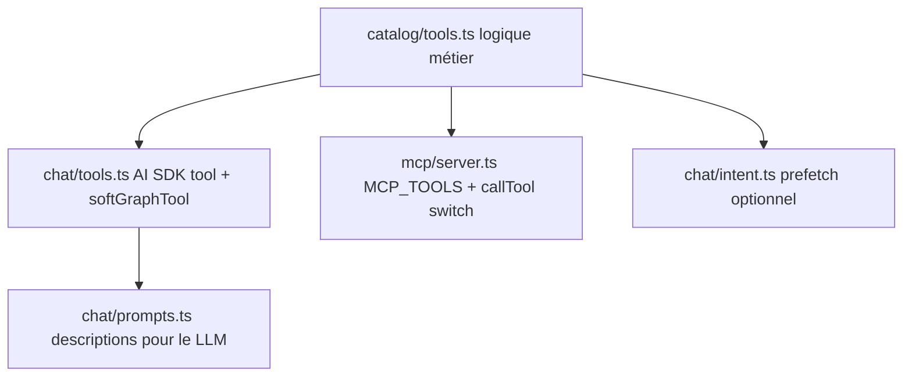

# 06 — Ajouter des tools & debugger

[← Deploy](./05-deploy.md) · [Index](./README.md) · [LLM →](./07-llm-providers.md)

Les tools sont partagés entre l’agent chat et le serveur MCP. **Ne jamais** dupliquer la logique métier dans `chat/tools.ts` ou `mcp/server.ts` : elle vit dans le catalogue.

## Architecture des 3 couches



| Couche | Fichier | Responsabilité |
|--------|---------|----------------|
| Métier | [`catalog/tools.ts`](../../packages/backend/src/rag/catalog/tools.ts) | Impl pure, retour JSON sérialisable |
| Cypher / data | [`graph/query.ts`](../../packages/backend/src/rag/graph/query.ts), [`notes-source.ts`](../../packages/backend/src/rag/notes-source.ts), [`vector/qdrant.ts`](../../packages/backend/src/rag/vector/qdrant.ts) | Accès stores |
| Agent | [`chat/tools.ts`](../../packages/backend/src/rag/chat/tools.ts) | `tool({ description, parameters: zod, execute })` |
| MCP | [`mcp/server.ts`](../../packages/backend/src/rag/mcp/server.ts) | Schema JSON + `callTool` switch |
| Prompt | [`prompts.ts`](../../packages/backend/src/rag/chat/prompts.ts) | Le LLM doit **savoir** que le tool existe |
| Intent | [`intent.ts`](../../packages/backend/src/rag/chat/intent.ts) | Uniquement si prefetch déterministe souhaité |

## Checklist : ajouter un tool

Exemple : `notesUpdatedSince` (hypothèse).

### 1. Implémentation catalogue

Dans `catalog/tools.ts` :

```ts
export async function notesUpdatedSince(db: Db, args: { sinceDays: number }) {
  // … Mongo ou Neo4j …
  return { notes: [/* { noteId, title, urlPath, … } */], grounded: true };
}
```

Conventions de retour utiles pour le LLM :

- Inclure `urlPath` (`/${noteId}`) pour les citations.
- Inclure `grounded: boolean` quand c’est une recherche « vide possible ».
- Pour le graphe : renvoyer un objet stable même si vide (`found: false`, arrays vides).

Si Cypher nouveau → ajouter la fonction dans `graph/query.ts`, puis un thin wrapper dans le catalogue.

### 2. Wrapper agent (`chat/tools.ts`)

```ts
notesUpdatedSince: tool({
  description:
    "Notes publiées modifiées dans les N derniers jours. Pas pour un sujet sémantique (préférer searchNotes).",
  parameters: z.object({
    sinceDays: z.number().describe("Fenêtre en jours (ex. 7)"),
  }),
  execute: async ({ sinceDays }) =>
    notesUpdatedSince(db, { sinceDays }),
}),
```

Si le tool touche Neo4j :

```ts
execute: async (args) =>
  softGraphTool(
    "notesUpdatedSince",
    () => notesUpdatedSince(args),
    { found: false, notes: [] },
  ),
```

`softGraphTool` loggue `[rag] tool <name>: …` et renvoie `error: "GRAPH_UNAVAILABLE"` sans throw.

### 3. MCP (`mcp/server.ts`)

1. Ajouter l’entrée dans le tableau `MCP_TOOLS` (`name`, `description`, `inputSchema`).
2. Importer la fonction catalogue.
3. Ajouter un `case` dans `callTool` avec validation Zod des args.
4. Retourner `asText(await …)` (JSON pretty-print dans `content[0].text`).

### 4. Prompt système

Mettre à jour la liste dans `STREAM_SYSTEM_PROMPT` ([`prompts.ts`](../../packages/backend/src/rag/chat/prompts.ts)) pour que le modèle sache quand appeler le tool. Sans ça, le tool peut être enregistré mais jamais choisi.

### 5. Prefetch (optionnel)

Si la question a un pattern regex fiable (« notes modifiées cette semaine ») :

- Étendre `PrefetchTool` / `ResolvedIntent` dans `intent.ts`.
- Ajouter le `case` dans `prefetchToolData` (`chat.ts`).

Sinon laisser le mode `auto` + descriptions.

### 6. Vérifications

```bash
npm run typecheck --workspace packages/backend

# Tool isolé via MCP (JWT)
curl -s -X POST "$API/rag/mcp/tools/notesUpdatedSince" \
  -H "Authorization: Bearer $TOKEN" \
  -H "Content-Type: application/json" \
  -d '{"sinceDays":7}'

# Via chat
curl -s -X POST "$API/rag/chat" \
  -H "Authorization: Bearer $TOKEN" \
  -H "Content-Type: application/json" \
  -d '{"messages":[{"role":"user","content":"…"}],"locale":"fr"}'
```

## Endpoints MCP

Préfixe `/rag`, auth JWT obligatoire.

| Méthode | Path | Rôle |
|---------|------|------|
| `GET` | `/rag/mcp` | Découverte |
| `GET` | `/rag/mcp/tools` | Liste `MCP_TOOLS` |
| `POST` | `/rag/mcp/tools/:name` | Appel direct (body = args) |
| `POST` | `/rag/mcp` | JSON-RPC : `initialize` \| `tools/list` \| `tools/call` |

Idéal pour debugger **sans** passer par le LLM (élimine « le modèle n’a pas choisi le tool »).

## Debug playbook

### Le chat répond « indisponible »

1. `GET /rag/health` — `configured` ? `qdrant` ?
2. Circuit breaker : 5 erreurs LLM → 60s de silence. Regarder logs `[rag] chat error:`.
3. Clés LLM / `LLM_PROVIDER` côté process API.

### Le tool n’est jamais appelé

1. Description trop vague / absente du system prompt.
2. Intent **prefetch** qui court-circuite les tools (regex trop large dans `intent.ts`).
3. `RAG_MAX_STEPS=1` trop bas pour un enchaînement search → getNote.
4. Tester le tool via MCP pour confirmer qu’il marche isolément.

### Soft-fail graphe

Logs : `[rag] tool relatedNotes: …`  
Réponse tool : `{ ok: false, error: "GRAPH_UNAVAILABLE", … }`

Checklist Neo4j :

- `NEO4J_URI` / user / password
- `GET /rag/health` → `neo4j: true`
- Browser http://localhost:7474 — `MATCH (n) RETURN count(n)`
- Sync a-t-il peuplé le graphe ? (`npm run rag:sync`, logs neo4j timeout ?)

### Mauvaise réponse factuelle

1. Appeler le tool MCP avec les mêmes args → données brutes correctes ?
2. Si données OK : problème de prompt / steps / hallucination → renforcer description « n’invente pas ».
3. Si données KO : bug catalogue / sync / score Qdrant (voir [03](./03-retrieval.md)).

### Sync

```bash
curl -s -H "Authorization: Bearer $ADMIN" "$API/rag/admin/sync/status"
# logs CLI
npm run rag:sync
```

Chercher : `SYNC_IN_PROGRESS`, `embedding batch`, `neo4j full sync skipped/failed`, `pruning N orphan`.

### Dashboards

| Outil | URL locale | Usage |
|-------|------------|-------|
| Qdrant dashboard | http://localhost:6333/dashboard | Points, payload `noteId` |
| Neo4j Browser | http://localhost:7474 | Cypher ad hoc |
| Logs API | terminal `npm run dev` | Préfixe `[rag]` |

## Anti-patterns

- Mettre du Cypher dans `chat/tools.ts`.
- Enregistrer un tool dans MCP mais pas dans `createChatTools` (ou l’inverse) — les clients divergent.
- Throw non catché depuis un tool Neo4j (toujours `softGraphTool`).
- Changer le shape JSON d’un tool sans vérifier prompts + front (citations `urlPath`).
