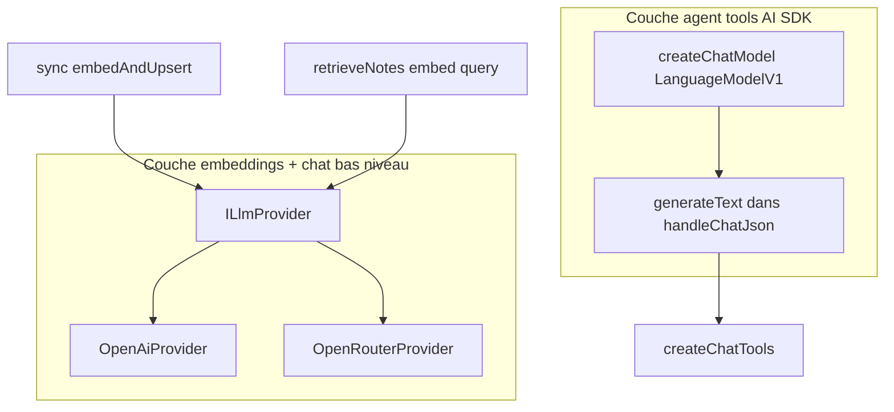

# 07 — Providers LLM

[← Tools & debug](./06-tools-debug.md) · [Index](./README.md) · [Front ↔ back →](./08-frontend-backend.md)

Il existe **deux couches LLM** distinctes. Les confondre est la cause n°1 d’un « j’ai ajouté Anthropic mais le chat ne marche pas ».

## Deux couches



| Couche | Fichiers | Usage |
|--------|----------|-------|
| **ILlmProvider** | [`llm/types.ts`](../../packages/backend/src/rag/llm/types.ts), [`llm/index.ts`](../../packages/backend/src/rag/llm/index.ts), [`openai.ts`](../../packages/backend/src/rag/llm/openai.ts), [`openrouter.ts`](../../packages/backend/src/rag/llm/openrouter.ts), [`client.ts`](../../packages/backend/src/rag/llm/client.ts) | `embed()` pour sync + search ; `chat()` utilitaire HTTP OpenAI-compatible |
| **AI SDK model** | [`chat/model.ts`](../../packages/backend/src/rag/chat/model.ts) | `generateText` avec tools / maxSteps |

Les deux lisent `ragConfig` (`LLM_PROVIDER`, clés, modèles). Aujourd’hui les deux supportent `openai` et `openrouter`.

## Config actuelle

[`config.ts`](../../packages/backend/src/rag/config.ts) :

```ts
export type LlmProvider = "openai" | "openrouter";
```

| Provider | Clé | Base URL | Notes |
|----------|-----|----------|-------|
| `openai` | `OPENAI_API_KEY` | `OPENAI_BASE_URL` optionnel | Défaut |
| `openrouter` | `OPENROUTER_API_KEY` | `OPENROUTER_BASE_URL` | Préfixe `openai/` ajouté aux modèles sans `/` |

Modèles :

- `CHAT_MODEL` — agent (`createChatModel`) + `ILlmProvider.chat`
- `EMBEDDING_MODEL` — sync + `retrieveNotes`
- `EMBEDDING_DIMENSIONS` — doit matcher la collection Qdrant

Factory embeddings :

```ts
// llm/index.ts
getLlmProvider() // singleton selon ragConfig.llmProvider
```

Factory agent :

```ts
// chat/model.ts
createChatModel() // createOpenAI({…})(chatModel)
```

## Basculer OpenAI → OpenRouter

```bash
LLM_PROVIDER=openrouter
OPENROUTER_API_KEY=sk-or-...
CHAT_MODEL=openai/gpt-4o-mini          # ou gpt-4o-mini (préfixe auto)
EMBEDDING_MODEL=openai/text-embedding-3-small
```

Puis sync full si le modèle d’embedding change (vecteurs incompatibles).

Penser SSM + `npm run secrets:set` en prod.

## Ajouter un 3ᵉ provider (procédure)

Objectif : support d’un provider nommé ex. `anthropic` ou un endpoint Azure custom.

### Étape A — Interface embeddings

1. Créer `packages/backend/src/rag/llm/<name>.ts` implémentant `ILlmProvider` :

```ts
export interface ILlmProvider {
  embed(texts: string[]): Promise<number[][]>;
  chat(messages: ChatMessage[], options?: { temperature?: number }): Promise<string>;
}
```

2. Si l’API est OpenAI-compatible : réutiliser `createLlmClient` / `embedTexts` / `chatCompletion` de `client.ts` avec une autre `baseURL` + clé.
3. Si non compatible (ex. Anthropic embeddings séparés) : implémenter `embed` / `chat` avec le SDK vendor.

### Étape B — Config

1. Étendre `LlmProvider` dans `config.ts` : `"openai" | "openrouter" | "anthropic"`.
2. Ajouter les champs `ragConfig` nécessaires (`anthropicApiKey`, …).
3. Mettre à jour `isLlmConfigured()`.

### Étape C — Factory

Dans `llm/index.ts` :

```ts
if (ragConfig.llmProvider === "anthropic") {
  provider = new AnthropicProvider();
}
```

### Étape D — Agent tools (`createChatModel`)

L’agent utilise `@ai-sdk/openai` aujourd’hui. Pour un vendor différent :

1. Installer le package AI SDK correspondant (`@ai-sdk/anthropic`, etc.).
2. Brancher dans `chat/model.ts` :

```ts
if (ragConfig.llmProvider === "anthropic") {
  const anthropic = createAnthropic({ apiKey: … });
  return anthropic(ragConfig.chatModel);
}
```

3. Vérifier que le modèle choisi **supporte les tool calls** (function calling) — sinon `generateText({ tools })` dégrade ou échoue.

### Étape E — Infra

1. `.env.example` + secrets SSM path + `serverless.yml` `environment:`.
2. Documenter `CHAT_MODEL` / `EMBEDDING_MODEL` recommandés.
3. **Reindex** si dimensions ou modèle d’embedding changent :

```bash
# éventuellement recreate collection Qdrant si taille de vecteur différente
npm run rag:sync
```

### Étape F — Tests

```bash
# Embed path
npm run rag:sync -- --note-id <id>

# Chat path
curl -X POST "$API/rag/chat" -H "Authorization: Bearer $TOKEN" \
  -H "Content-Type: application/json" \
  -d '{"messages":[{"role":"user","content":"Liste les tags"}],"locale":"fr"}'
```

## Changer seulement le modèle (même provider)

Souvent suffisant :

```bash
CHAT_MODEL=gpt-4o
# ou OpenRouter :
CHAT_MODEL=anthropic/claude-3.5-sonnet
```

Pas de reindex si seul le chat change.  
Reindex **obligatoire** si `EMBEDDING_MODEL` ou `EMBEDDING_DIMENSIONS` change.

## Pièges

| Piège | Effet |
|-------|-------|
| Brancher seulement `createChatModel` | Sync / search cassés (toujours ancien provider pour embed) |
| Brancher seulement `ILlmProvider` | Chat tools peut encore pointer OpenAI |
| Dimensions embedding ≠ collection | Upsert / search Qdrant échouent |
| Modèle sans tool calling | Prefetch marche ; mode auto tools foire |
| OpenRouter model sans préfixe vendor | Auto-préfixe `openai/` — peut être faux pour Claude → mettre `anthropic/…` explicite |
| Singleton `getLlmProvider()` | Changer l’env sans redémarrer le process = ancien provider en mémoire (dev) |
