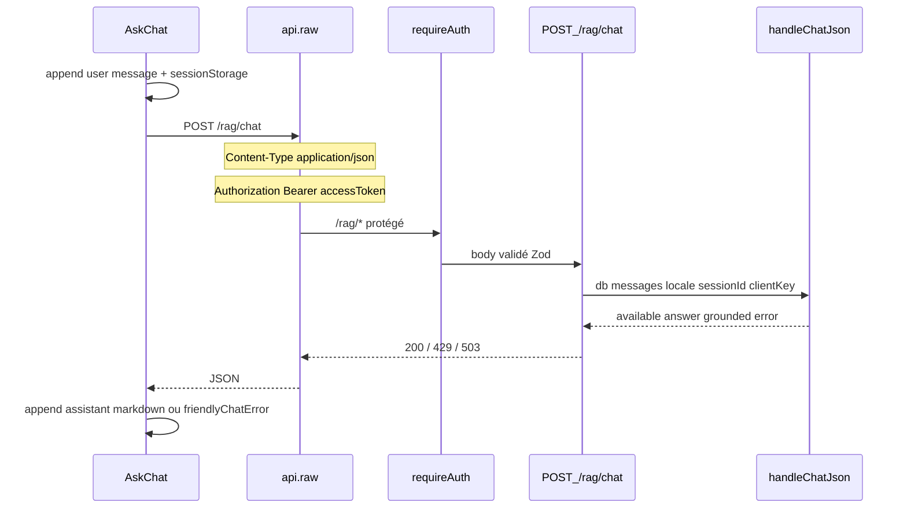

# 08 — Communication front ↔ back (chat)

[← LLM providers](./07-llm-providers.md) · [Index](./README.md)

Le front n’appelle **jamais** Qdrant ni Neo4j. Tout passe par l’API Hono `POST /rag/chat` avec JWT.

## Fichiers

| Rôle | Chemin |
|------|--------|
| Page | [`packages/frontend/app/(app)/ask/page.tsx`](../../packages/frontend/app/(app)/ask/page.tsx) |
| UI chat | [`packages/frontend/src/components/AskChat.tsx`](../../packages/frontend/src/components/AskChat.tsx) |
| Client HTTP | [`packages/frontend/src/lib/api.ts`](../../packages/frontend/src/lib/api.ts) (`api.raw` = `request`) |
| Auth | [`packages/frontend/src/lib/auth-context.tsx`](../../packages/frontend/src/lib/auth-context.tsx) — access token mémoire |
| Route API | [`packages/backend/src/routes/rag.ts`](../../packages/backend/src/routes/rag.ts) |
| Handler | [`packages/backend/src/rag/chat/chat.ts`](../../packages/backend/src/rag/chat/chat.ts) `handleChatJson` |
| Nav lien | [`NavBar.tsx`](../../packages/frontend/src/components/NavBar.tsx) → `/ask` |

Env front : `NEXT_PUBLIC_API_URL` (base de l’API, sans path `/rag`).

## Protocole

- **Transport** : HTTP JSON **one-shot** (pas de SSE, pas de WebSocket, pas de streaming tokens).
- **Auth** : `Authorization: Bearer <access_token>` injecté par `api.request` si session active.
- **Refresh** : sur 401, `api` tente un refresh dédupliqué puis **un** retry.



## Contrat requête

Body validé par `chatSchema` côté backend :

```json
{
  "messages": [
    { "role": "user", "content": "…" },
    { "role": "assistant", "content": "…" }
  ],
  "locale": "fr",
  "sessionId": null
}
```

| Champ | Requis | Notes |
|-------|--------|-------|
| `messages` | oui | min 1 ; roles autorisés côté Zod : `system` \| `user` \| `assistant` \| `data` \| `tool` |
| `locale` | non | défaut effectif `"fr"` dans la route |
| `sessionId` | non | fallback rate-limit si pas d’IP |

Le front envoie **tout l’historique** visible (user + assistant) à chaque tour — pas de thread id serveur.

Exemple côté `AskChat` :

```ts
const res = await api.raw<{
  available: boolean;
  answer?: string;
  error?: string;
}>("/rag/chat", {
  method: "POST",
  body: {
    messages: next.map((m) => ({ role: m.role, content: m.content })),
    locale: "fr",
  },
});
```

## Contrat réponse

```json
{
  "available": true,
  "answer": "Markdown avec [Titre](https://app…/id)",
  "grounded": true,
  "error": null
}
```

| HTTP | Cas | Front |
|------|-----|-------|
| 200 | Réponse normale (`answer` présent) | Affiche bulle assistant (ReactMarkdown) |
| 200 | `answer` vide mais `available` | « Aucune réponse. » |
| 429 | `RAG_RATE_LIMITED` | `ApiClientError` ou message mapped |
| 503 | `RAG_DISABLED` / indispo config | Erreur / message friendly |

Mapping UX dans `friendlyChatError` :

| Code | Message FR (résumé) |
|------|---------------------|
| `RAG_RATE_LIMITED` | Trop de questions… |
| `RAG_TIMEOUT` | Trop long… |
| `RAG_UNAVAILABLE` | Temporairement indisponible… |
| `RAG_DISABLED` | Pas configuré… |

> Attention : pour timeout / unavailable, le backend peut renvoyer **200** avec `error` + `answer` friendly. Le front priorise `res.answer` s’il est présent — l’utilisateur voit le texte, pas forcément le code.

## État UI local

- Messages : `useState<ChatMessage[]>` (`id`, `role`, `content`).
- Persistance onglet : `sessionStorage` clé `cinco-wiki:ask-chat`.
- Bouton « Effacer » vide state + storage.
- Pendant l’appel : `busy` → spinner « Réflexion en cours… », input désactivé.
- Pas d’affichage des tool calls / steps / scores — uniquement le markdown final.

## Citations / liens

1. Le system prompt backend impose `[Titre](${PUBLIC_APP_URL}${urlPath})` ou lien relatif `urlPath`.
2. `AskChat` rend les liens via `ReactMarkdown` + composant `MarkdownLink`.
3. Si le path matche `/[objectId 24 hex]` → ouverture en nouvel onglet sur ce path (même origine front).

`PUBLIC_APP_URL` doit donc être l’origine réelle du front (prod Netlify ou `http://localhost:3001`).

## Auth : implications

- `/ask` est sous le layout app authentifié ; sans session, l’utilisateur ne reste en général pas sur l’app.
- Même un health check `/rag/health` exige un JWT.
- Le rate limit peut utiliser l’IP (`x-forwarded-for`) derrière un proxy — important en prod.

## Ce qui n’existe pas (volontairement)

| Feature | État |
|---------|------|
| Streaming token-by-token | Non |
| Affichage des tool calls dans l’UI | Non |
| Thread / conversation id serveur | Non (historique client only) |
| Upload fichiers dans le chat | Non |
| Accès anonyme `/rag/chat` | Non (`requireAuth`) |

## Étendre le front

Pour du streaming plus tard :

1. Ajouter une route backend (ex. `POST /rag/chat/stream`) avec `streamText` AI SDK.
2. Adapter `AskChat` (ReadableStream / `useChat` Vercel AI).
3. Garder le JSON actuel pour MCP / clients simples.

Pour afficher les sources : parser `grounded` + éventuellement enrichir la réponse backend avec une liste `citations[]` (aujourd’hui absente — les liens sont dans le markdown).
