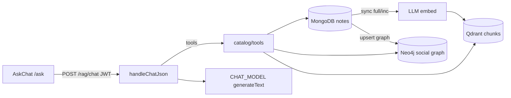

# GraphRAG Cinco Wiki — documentation reprise

Guide pour un développeur qui reprend l’assistant wiki (Qdrant + Neo4j + agent LLM).  
Code source : [`packages/backend/src/rag/`](../../packages/backend/src/rag/). UI : [`/ask`](../../packages/frontend/app/(app)/ask/page.tsx).

## Sommaire

| Page | Contenu |
|------|---------|
| [01 — Architecture](./01-architecture.md) | Stores, flags, arborescence, responsabilités |
| [02 — Sync](./02-sync.md) | Full / incrémental notes / social, chunking, embeddings |
| [03 — Retrieval](./03-retrieval.md) | Recherche vectorielle, graphe Neo4j, Cypher |
| [04 — Chat agent](./04-chat-agent.md) | Pipeline question → réponse, intent, tools, graphPath |
| [05 — Deploy](./05-deploy.md) | Local, VPS, Lambda/SSM, variables d’env, pièges |
| [06 — Tools & debug](./06-tools-debug.md) | Ajouter un tool, MCP, checklist debug |
| [07 — LLM providers](./07-llm-providers.md) | OpenAI / OpenRouter, ajouter un 3ᵉ provider |
| [08 — Front ↔ back](./08-frontend-backend.md) | Contrat HTTP, auth, erreurs, sessionStorage |

## Glossaire FR / EN

| FR | EN | Signification |
|----|-----|---------------|
| Recherche sémantique | Vector / semantic search | Similarité d’embeddings dans Qdrant |
| Graphe social | Social knowledge graph | Nœuds Note/User/Tag/Comment dans Neo4j |
| Chunk | Chunk | Morceau de texte indexé (titre + corps découpé) |
| Embedding | Embedding | Vecteur numérique d’un chunk / d’une query |
| Tool / outil agent | Tool | Fonction que le LLM peut appeler (Vercel AI SDK) |
| Prefetch | Prefetch intent | Intent déterministe : données chargées sans round-trip tools |
| Soft-fail | Soft-fail | Erreur Neo4j absorbée → `{ ok: false, error: "GRAPH_UNAVAILABLE" }` |
| Sync full | Full reindex | Toutes les notes publiées → Qdrant (+ Neo4j) |
| Sync incrémental | Incremental sync | Une note après create/update/unpublish |
| Sync social | Social sync | Votes/commentaires → arêtes + stats payload (sans re-embed) |
| Grounded | Grounded | Réponse basée sur des tools / données prefetch |

## Vue d’ensemble



- **Source de vérité** : MongoDB (notes `published` uniquement).
- **Qdrant** : index vectoriel des chunks — obligatoire pour activer le RAG.
- **Neo4j** : graphe optionnel (auteurs, tags, liens internes, votes, commentaires).
- **Agent** : `generateText` (Vercel AI SDK) avec un catalogue fixe de tools.
- Sans `QDRANT_URL` + clé LLM → routes renvoient `RAG_DISABLED`. Sans Neo4j → chat vectoriel OK, tools graphe soft-fail.

## Quick start (≈ 15 min, local)

Prérequis : Docker, MongoDB accessible (`MONGODB_URI`), clé OpenAI (ou OpenRouter).

```bash
# 1. Stack vectorielle + graphe
npm run qdrant:up

# 2. Env backend (racine ou packages/backend)
#    QDRANT_URL=http://localhost:6333
#    OPENAI_API_KEY=...
#    NEO4J_URI=bolt://localhost:7687
#    NEO4J_USER=neo4j
#    NEO4J_PASSWORD=changeme
#    PUBLIC_APP_URL=http://localhost:3001
#    (+ MONGODB_URI, JWT_SECRET…)

# 3. Index initial
npm run rag:sync

# 4. API + front
npm run dev          # serverless offline → API
npm run frontend     # Next → /ask
```

Vérifications :

```bash
# Health (JWT requis — /rag/* est derrière requireAuth)
curl -s -H "Authorization: Bearer <access_token>" \
  http://localhost:3000/rag/health

# Chat
curl -s -X POST http://localhost:3000/rag/chat \
  -H "Authorization: Bearer <access_token>" \
  -H "Content-Type: application/json" \
  -d '{"messages":[{"role":"user","content":"Quelles notes parlent d onboarding ?"}],"locale":"fr"}'
```

| Service | URL locale |
|---------|------------|
| Qdrant HTTP / dashboard | http://localhost:6333 |
| Neo4j Browser | http://localhost:7474 |
| Neo4j Bolt | `bolt://localhost:7687` |
| UI assistant | http://localhost:3001/ask |

## Scripts npm utiles

| Script | Action |
|--------|--------|
| `npm run qdrant:up` / `qdrant:down` | Docker **dev** ([`docker-compose.rag.yml`](../../docker-compose.rag.yml)) |
| `npm run rag:prod:up` / `rag:prod:down` | Docker **prod** ([`docker-compose.rag.prod.yml`](../../docker-compose.rag.prod.yml) + `.env.rag.prod`) |
| `npm run rag:sync` | Reindex complet CLI |
| `npm run rag:sync -- --note-id <id>` | Sync d’une note |
| `npm run rag:sync -- --delete-note <id>` | Purge index d’une note |

## Où regarder en premier

1. Config / flags : [`packages/backend/src/rag/config.ts`](../../packages/backend/src/rag/config.ts)
2. Sync : [`packages/backend/src/rag/sync/indexer.ts`](../../packages/backend/src/rag/sync/indexer.ts)
3. Chat : [`packages/backend/src/rag/chat/chat.ts`](../../packages/backend/src/rag/chat/chat.ts)
4. Tools agent : [`packages/backend/src/rag/chat/tools.ts`](../../packages/backend/src/rag/chat/tools.ts) → catalogue [`catalog/tools.ts`](../../packages/backend/src/rag/catalog/tools.ts)
5. Routes HTTP : [`packages/backend/src/routes/rag.ts`](../../packages/backend/src/routes/rag.ts)
6. Front : [`packages/frontend/src/components/AskChat.tsx`](../../packages/frontend/src/components/AskChat.tsx)
